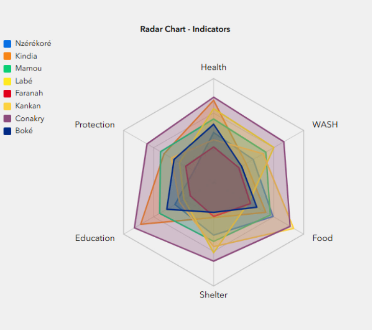

# Exercise 3 — Experience Builder: Radar Chart Widget

> 💡 **Tip:** Press `Ctrl+Shift+V` to view this file as a formatted preview (or `Cmd+Shift+V` on Mac).
> New to VS Code? Keep [Exercise 0 — VS Code and GitHub Copilot setup](../exercise-00-vscode-setup/exercise-00-vscode-setup.md) open for reference.

This exercise is optional to complete. Valerie will demonstrate the workflow. Feel free to follow along in your own VS Code instance using the guide. If you would like to work through this exercise after the training, here is a [video walkthrough](https://www.youtube.com/watch?v=NuxNCvL0UUA).

**What you'll build:** a custom ArcGIS Experience Builder widget that draws a radar (spider) chart from a configured feature layer, with a rich settings panel.

We'll design it first using `/grill-with-docs`, then build it.

> **Before you start:** This exercise requires Experience Builder Developer Edition, installed in pre-work doc 4: [Set up Experience Builder Developer Edition (optional)](../docs/04-experience-builder.md). We're going to use **Experience Builder Developer Edition 1.20** which will allow you to deploy custom widgets on **ArcGIS Enterprise 12.1**. When developing custom widgets in the future, confirm the version you need with the [Experience Builder release and version table](https://developers.arcgis.com/experience-builder/guide/release-versions/).

---

## Step 1 — Open your Experience Builder Folder in VS Code

We'll be using a different VS Code workspace for this exercise, so you can save your edits from Exercises 1-3.

Open a new window of VS Code so you can keep these instructions open. In VS Code: **File → New Window**

You'll work inside the Experience Builder Developer Edition folder you downloaded and unzipped in the pre-work.

1. Find where you unzipped the Experience Builder 1.20 files. In this example it's:
   `C:\dev\arcgis-experience-builder-1.20`

2. In VS Code: **File → Open Folder** and open that Experience Builder folder.

3. Open a terminal inside VS Code: **Terminal → New Terminal** (or `` Ctrl+` ``).

---

## Step 2 — Install the Skills

Because we're in a new project, you will need to add the skills again. This is the same workflow as Exercise 1.

Run these two commands, one at a time, in the terminal:

### Command 1

```
npx skills@latest add mattpocock/skills
```

> **Windows note:** If the command above returns an error, try:
>
> `npx.cmd skills@latest add mattpocock/skills`

1. Your keyboard strokes will be to paste the above then hit enter to run.

2. If prompted with `Ok to proceed? (y)`, type `y` and hit `Enter`.

3. When the skills load, press the spacebar on your keyboard to select all skills. All the empty dots in the terminal will turn green indicating they have been selected. Press `Enter` to continue.

4. No need to install additional agents, so press `Enter` again.

5. The setup defaults to `Project` - which installs in the current directory, press `Enter` to confirm.

6. Press `Enter` to proceed with installation.

7. If successful, you should see a message like this:

   `Done! Review skills before use; they run with full agent permissions.`

### Command 2

```
npx skills@latest add valdesrosier/arcgis-skills
```

> **Windows note:** If the command above returns an error, try:
>
> `npx.cmd skills@latest add valdesrosier/arcgis-skills`

1. As with `Command 1`, press the spacebar on your keyboard to select all ArcGIS Skills. All the empty dots in the terminal will turn green indicating they have been selected. Press `Enter` to continue.

2. No need to install additional agents, so press `Enter` again.

3. As before, the setup defaults to `Project` - which installs in the current directory, press `Enter` to confirm.

4. Press `Enter` to proceed with installation.

5. If successful, you should see a message like this:

   `Done! Review skills before use; they run with full agent permissions.`

## Step 3 — Setup your skills and start the design interview

1. Open **Copilot Chat** using the chat box to the right of the search bar at the top of the Visual Studio window.

2. Ensure you are on "Agent" mode and select either **GPT 5.6 Sol** or **Opus 5** for the model.

3. When it's ready, start by typing a forward slash (`/`) to see the list of available skills. Select `/setup-matt-pocock-skills` from the list by arrowing up or down to highlight it and then press tab. You'll notice that the slash and text turns into a blue pill shape. This is normal for invoking a skill. You are able to type more context after the pill shape, but for now just hit `Enter` to run the skill.
   - You may be prompted at various times during the skill to allow access to your local files or to run `git` commands. Click **Allow** when prompted.

   > [!NOTE]
   > **What `/setup-matt-pocock-skills` does:** This is a one-time setup command for Matt's skills. It wires them into your project's workflow — it asks which **issue tracker** you use (GitHub, Linear, or local files), what **labels** you apply when triaging tickets, and where to **save the docs** the skills create (like `CONTEXT.md` and ADRs). It's what lets later skills publish tickets and save their paper trail in a consistent place. You run it once per project — we're running it here in the cloned repo, and exercises 2 and 3 reuse it.

4. During the setup skill, if asked on the following (you can reply in the chat with natural language):
   - **Issue tracker:** choose local markdown
   - **Labels:** choose to keep the defaults
   - **Domain Docs :** choose to create AGENTS.md

   - When done, you should see something similar to this in the chat panel:
     

---

## Step 4 — The prompt

> **About:** `/grill-with-docs` interviews you and writes down the design (it does **not** write the code yet). Answer its questions, ask follow up and clarifyication questions as needed. Once the design is settled, you'll tell it to build.

1. Start by typing a forward slash (`/`) to see the list of available skills. Select `/grill-with-docs` from the list by arrowing up or down to highlight it and then press tab, but do not press enter yet.

2. Paste the prompt below after the pill shape.

```
I'd like to build an ArcGIS Experience Builder custom widget that is a radar chart (spider chart). I am using Experience Builder developer edition version 1.20 and will deploy it on ArcGIS Enterprise 12.1.

Before grilling me on design decisions, use the the exb-widget skill and the arcgis-docs-lookup skill to look up anything you are not sure about for the overall design and approach.

The widget draws a radar chart from a single configured feature layer - select the layer from the map in the widget settings: each feature is one record, and I pick which numeric fields become the axes through the settings panel, so don't hard-code field names.

Settings I'd like to be able to change:
Configure the maximum for the axes (default 100)
Choose how many axes are available (max 10)
Position axis labels around the outside without overlapping the plot,
allow the user to change the labels, size them, and wrap text
Configure each row in the dataset as a polygon on the radar chart and
select which to include - let the user choose the colors, transparency,
and if the data points have dots
Allow for either single row view (one at a time on the radar chart) or
all overlapping with transparency (these should change as selection or
filter changes)
If a feature is missing a value on an axis, break the line
Add / change title of the chart
Add legend and select location of legend on the chart (above, below,
left, or right of chart)
Turn on and off radial axis scales
Turn on and off data point labels
Turn on and off spoke lines and internal axes lines

Overall, the chart should function with the existing ArcGIS Experience Builder data schema and should reflect the themes.

Ask me about anything ambiguous before we settle the design.
```

---

## Step 5 — What happens next

1. Answer each question in the chat. You can answer however you like, as long it's clear to the model which question you are answering. You can also ask follow up questions to clarify anything you don't understand. The skill will write down the design as you go.
   - Example: "q1: agreed, q2: explain in less technical terms, q3-6: agreed, q7: yes but add ..."

   > [!NOTE]
   > Copilot may ask your approval to run commands during the course of a response. Be sure to review the **command summary** beneath the code preview to see what commands it wants to run. If you approve, click **Allow**. If you don't, click **Skip** and ask the model to clarify or change its approach.

   

2. When the design is settled, copilot may begin implementing on its own. If not you can use the `/implement` skill to tell it to start building the cards and any other files needed for the project.

   The widget gets built under `client/your-extensions/widgets/` inside your Experience Builder folder.

## Step 6 - Start Experience Builder to view your widget

### Install the Server Service

The Server service is responsible for running the builder interface of developer edition of Experience Builder. The server service must be running in order to see your changes in the builder interface.

1. Open a command prompt or terminal window.

2. Within the terminal, browse to the server directory of the Experience Builder files that you unzipped in the steps above:

```powershell
cd C:\dev\arcgis-experience-builder-1.20\server
```

3. Run the following commands (If you get a privileges error, run `npm.cmd ci` and `npm.cmd start` instead):

```powershell
npm ci
```

```powershell
npm start
```

> If `npm start` gives you an EBUSY error. Run: `taskkill /F /IM node.exe /T` on both the server and the client terminals then run again.

> [!NOTE]
> Starting with version 1.21, you must use pnpm to install dependencies. If you run npm ci or npm i with version 1.21 or newer, you will see an error. See the [Experience Builder Developer Edition install guide](https://developers.arcgis.com/experience-builder/guide/install-guide/) for more information if you're developing using the more recent versions in the future.

5. Leave this power shell or terminal open to keep it running.

### Install the Client Service

The Client service is responsible for running the webpack server, which is used to bundle and load your custom widgets and themes. The client service must be running in order to see your changes in the builder interface.

1. Open VS Code in a New Window.

2. In VS Code: File → Open Folder and open the folder location of your unzipped Experience Builder files.

3. Open a terminal inside VS Code: **Terminal → New Terminal** (or `` Ctrl+` ``).

4. Within the terminal, browse to the `/client` directory of the Experience Builder files that you unzipped in the previous section using the `cd` command.

```powershell
cd client
```

5. Run the following commands (If you had the privileges error from installing the server service, run `npm.cmd ci` and `npm.cmd start` as well):

```powershell
npm ci
```

```powershell
npm start
```

> If `npm start` gives you an EBUSY error. Run: `taskkill /F /IM node.exe /T` on both the server and the client terminals then run again.

> [!NOTE]
> Starting with version 1.21, you must use pnpm to install dependencies. If you run npm ci or npm i with version 1.21 or newer, you will see an error. See the [Experience Builder Developer Edition install guide](https://developers.arcgis.com/experience-builder/guide/install-guide/) for more information if you're developing using the more recent versions in the future.

> [!NOTE]
> If you are using Chrome, you may experience issues. Try using Edge or Firefox instead.

### Test your new widget

1. **Open your browser** at:

```
   https://localhost:3001
```

2. Sign in using your Experience Builder Client ID from the pre-work.

3. Create a new experience or import one of your existing Experience Builder apps.

4. Open the Insert widget pane on the left side of the Experience Builder window. Scroll to the bottom of the available widgets to see the `Custom` widgets.

5. Add your new **radar chart widget** to your Experience Builder to see it live.

6. Add this Web Map to your Experience Builder to test the functionality: `3298b42d5f534ab886fbe4b2364bb38f`
   - This web map focuses on fictional indicator data for Guinea. Here is the likely formatting for the radar chart:
     - Use the adm1_name for the series label
     - Use cap_health, cap_food, cap_wash, cap_education, cap_protection, and cap_shelter as the Axes of the radar chart
     - Example of the finished widget:
       

7. Make changes as needed to the widget using Copilot. As you edit the widget code, the client should automatically update and you can refresh your browser to see changes.

> [!TIP]
> If you're building custom widgets for Experience Builder, keep them in their own repository rather than committing the entire Experience Builder Developer Edition alongside them. That way you version-control only your widget code, not the thousands of files that ship with the developer edition. For an example of this structure, see [custom-experience-builder-widgets](https://github.com/valdesrosier/custom-experience-builder-widgets).

> [!NOTE]
> If you're tracking your work in Git, add a `.gitignore` before you commit. The `node_modules/` folder holds tens of thousands of files you don't want in version control. Create a `.gitignore` in your project folder with this line:
>
> ```
> node_modules/
> ```
>
> Do this before your first commit. If you already staged `node_modules/`, run `git rm -r --cached node_modules/` to unstage it, then commit.
